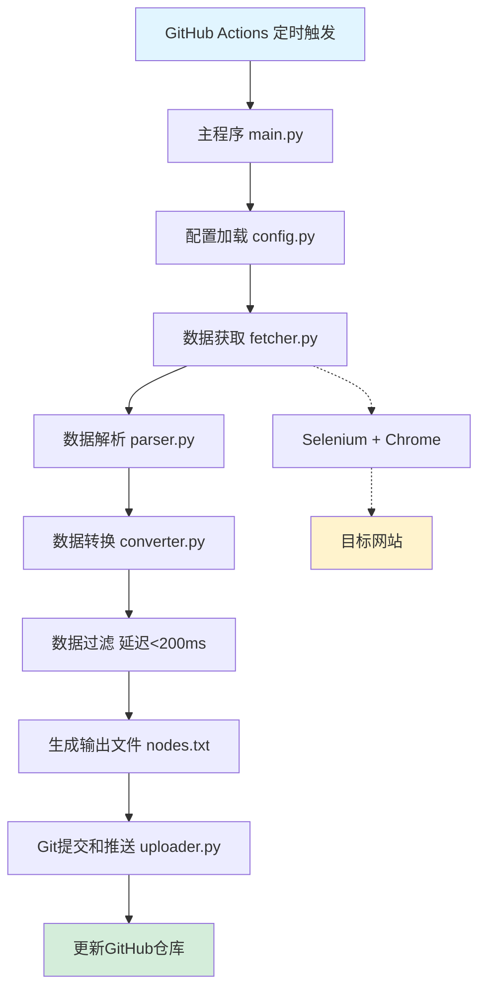
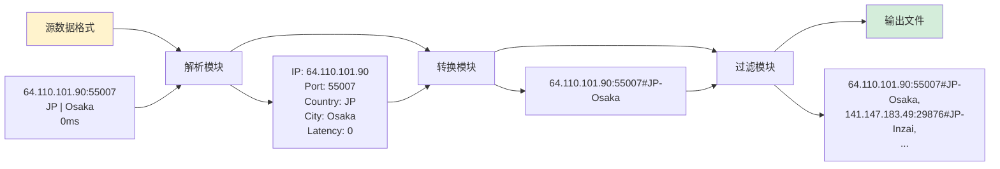
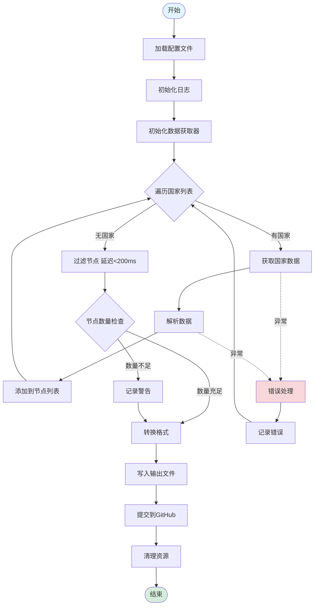

# 优选IP自动更新系统 - 架构设计文档

## 1. 项目概述

### 1.1 项目目标
创建一个自动化系统，从 https://cfip.wxgqlfx.fun/ 获取优选Cloudflare节点IP，转换格式后自动更新到GitHub仓库，供订阅项目使用。

### 1.2 核心功能
- 自动从网页获取优选IP节点数据
- 数据格式转换（源格式 → 目标格式）
- 延迟过滤（保留 < 200ms 的节点）
- 自动提交到GitHub仓库
- 定时执行（通过GitHub Actions）

### 1.3 技术栈选型

| 技术 | 选型 | 理由 |
|------|------|------|
| 编程语言 | Python 3.9+ | 丰富的网络请求和数据处理库 |
| 网页数据获取 | Selenium + Chrome | 网页需要交互操作（选择国家、点击查询） |
| 数据解析 | BeautifulSoup4 | 强大的HTML解析能力 |
| 自动化部署 | GitHub Actions | 云端运行，无需本地服务器 |
| 版本控制 | Git | GitHub原生支持 |
| 配置管理 | YAML | 易读易写，支持注释 |

---

## 2. 项目文件结构

```
clash-cf-updater/
├── .github/
│   └── workflows/
│       └── update-ips.yml          # GitHub Actions工作流配置
├── src/
│   ├── __init__.py
│   ├── fetcher.py                  # 数据获取模块
│   ├── parser.py                   # 数据解析模块
│   ├── converter.py                # 数据转换模块
│   ├── uploader.py                 # GitHub上传模块
│   └── config.py                   # 配置加载模块
├── output/
│   └── nodes.txt                   # 输出的节点文件
├── config/
│   └── settings.yaml               # 配置文件
├── logs/
│   └── .gitkeep                    # 日志目录占位
├── tests/
│   ├── __init__.py
│   ├── test_fetcher.py
│   ├── test_parser.py
│   └── test_converter.py
├── requirements.txt                # Python依赖
├── main.py                         # 主程序入口
├── README.md                       # 项目说明文档
├── ARCHITECTURE.md                 # 架构设计文档（本文件）
├── .gitignore                      # Git忽略文件
└── LICENSE                         # 开源许可证
```

---

## 3. 系统架构设计

### 3.1 整体架构图



### 3.2 数据流程图



---

## 4. 核心模块设计

### 4.1 数据获取模块 (fetcher.py)

**职责：** 使用Selenium自动化浏览器操作，从网页获取数据

**核心功能：**
- 初始化Chrome浏览器（无头模式）
- 访问目标网站
- 选择国家/地区（支持多个国家）
- 设置结果数量为20
- 点击查询按钮
- 等待结果加载
- 提取页面数据

**关键技术点：**
```python
# 伪代码示例
class IPFetcher:
    def __init__(self, config):
        self.config = config
        self.driver = None
    
    def setup_driver(self):
        # 配置Chrome选项（无头模式、禁用GPU等）
        pass
    
    def fetch_ips(self, country):
        # 1. 访问网站
        # 2. 选择国家
        # 3. 设置数量为20
        # 4. 点击查询
        # 5. 等待结果
        # 6. 提取数据
        pass
    
    def close(self):
        # 关闭浏览器
        pass
```

**错误处理：**
- 网络超时重试（最多3次）
- 元素未找到异常处理
- 页面加载失败处理

---

### 4.2 数据解析模块 (parser.py)

**职责：** 解析HTML内容，提取结构化数据

**输入格式：**
```
64.110.101.90:55007
JP | Osaka
0ms
```

**输出格式：**
```python
{
    "ip": "64.110.101.90",
    "port": "55007",
    "country": "JP",
    "city": "Osaka",
    "latency": 0
}
```

**核心功能：**
```python
class IPParser:
    def parse_node_list(self, html_content):
        # 使用BeautifulSoup解析HTML
        # 提取每个节点的信息
        pass
    
    def parse_single_node(self, node_element):
        # 解析单个节点
        # 返回结构化数据
        pass
    
    def extract_ip_port(self, text):
        # 正则表达式提取IP和端口
        # 格式: IP:PORT
        pass
    
    def extract_location(self, text):
        # 提取国家和城市
        # 格式: COUNTRY | CITY
        pass
    
    def extract_latency(self, text):
        # 提取延迟值
        # 格式: XXms
        pass
```

**数据验证：**
- IP地址格式验证
- 端口范围验证（1-65535）
- 延迟值验证（数字类型）

---

### 4.3 数据转换模块 (converter.py)

**职责：** 将解析后的数据转换为目标格式

**转换规则：**
- 节点名称格式：`国家代码-城市名`（如：`JP-Osaka`）
- 输出格式：`IP:端口#节点名称`
- 多个节点用逗号分隔

**核心功能：**
```python
class IPConverter:
    def convert_to_output_format(self, nodes):
        # 转换节点列表为输出格式
        pass
    
    def generate_node_name(self, country, city):
        # 生成节点名称: 国家-城市
        return f"{country}-{city}"
    
    def format_single_node(self, node):
        # 格式化单个节点
        # 返回: IP:PORT#NAME
        pass
    
    def filter_by_latency(self, nodes, max_latency=200):
        # 过滤延迟大于阈值的节点
        pass
```

**示例转换：**
```
输入:
{
    "ip": "64.110.101.90",
    "port": "55007",
    "country": "JP",
    "city": "Osaka",
    "latency": 0
}

输出:
64.110.101.90:55007#JP-Osaka
```

---

### 4.4 GitHub上传模块 (uploader.py)

**职责：** 将生成的文件提交到GitHub仓库

**核心功能：**
```python
class GitHubUploader:
    def __init__(self, config):
        self.repo_path = config.repo_path
        self.branch = config.branch
    
    def commit_and_push(self, file_path, commit_message):
        # 1. git add
        # 2. git commit
        # 3. git push
        pass
    
    def generate_commit_message(self):
        # 生成提交信息
        # 格式: "Update nodes - YYYY-MM-DD HH:MM:SS"
        pass
```

**认证方式：**
- 使用GitHub Actions内置的 `GITHUB_TOKEN`
- 自动配置Git用户信息

---

### 4.5 配置管理模块 (config.py)

**职责：** 加载和管理配置参数

**配置文件示例 (settings.yaml)：**
```yaml
# 数据源配置
source:
  url: "https://cfip.wxgqlfx.fun/"
  countries:
    - "日本"
    - "美国"
    - "香港"
    - "新加坡"
  result_count: 20
  timeout: 30

# 过滤配置
filter:
  max_latency: 200  # 最大延迟（毫秒）
  min_nodes: 5      # 最少节点数

# 输出配置
output:
  file_path: "output/nodes.txt"
  format: "ip_port_name"  # 或 "ip_port"
  separator: ","

# GitHub配置
github:
  branch: "main"
  commit_message_template: "Update nodes - {timestamp}"

# 浏览器配置
browser:
  headless: true
  timeout: 30
  retry_times: 3

# 日志配置
logging:
  level: "INFO"
  file: "logs/updater.log"
  max_size: "10MB"
  backup_count: 5
```

**核心功能：**
```python
class Config:
    def __init__(self, config_path):
        self.config_path = config_path
        self.data = None
    
    def load(self):
        # 加载YAML配置文件
        pass
    
    def get(self, key, default=None):
        # 获取配置项
        pass
    
    def validate(self):
        # 验证配置完整性
        pass
```

---

## 5. GitHub Actions工作流设计

### 5.1 工作流配置 (.github/workflows/update-ips.yml)

```yaml
name: Update Cloudflare IPs

on:
  schedule:
    # 每6小时执行一次
    - cron: '0 */6 * * *'
  workflow_dispatch:  # 支持手动触发

jobs:
  update-ips:
    runs-on: ubuntu-latest
    
    steps:
      - name: Checkout repository
        uses: actions/checkout@v3
        with:
          token: ${{ secrets.GITHUB_TOKEN }}
      
      - name: Set up Python
        uses: actions/setup-python@v4
        with:
          python-version: '3.9'
      
      - name: Install dependencies
        run: |
          pip install -r requirements.txt
      
      - name: Install Chrome and ChromeDriver
        run: |
          sudo apt-get update
          sudo apt-get install -y chromium-browser chromium-chromedriver
      
      - name: Run updater
        run: |
          python main.py
        env:
          GITHUB_TOKEN: ${{ secrets.GITHUB_TOKEN }}
      
      - name: Commit and push changes
        run: |
          git config --local user.email "github-actions[bot]@users.noreply.github.com"
          git config --local user.name "github-actions[bot]"
          git add output/nodes.txt
          git diff --quiet && git diff --staged --quiet || (git commit -m "Update nodes - $(date +'%Y-%m-%d %H:%M:%S')" && git push)
```

### 5.2 执行频率说明

| 方案 | Cron表达式 | 说明 |
|------|-----------|------|
| 每小时 | `0 * * * *` | 更新频繁，适合实时性要求高的场景 |
| 每6小时 | `0 */6 * * *` | **推荐方案**，平衡更新频率和资源消耗 |
| 每12小时 | `0 */12 * * *` | 适合数据变化不频繁的场景 |
| 每天一次 | `0 0 * * *` | 适合数据稳定的场景 |

---

## 6. 主程序流程设计

### 6.1 main.py 流程图



### 6.2 主程序伪代码

```python
def main():
    try:
        # 1. 加载配置
        config = Config('config/settings.yaml')
        config.load()
        
        # 2. 初始化日志
        setup_logging(config)
        logger.info("程序启动")
        
        # 3. 初始化各模块
        fetcher = IPFetcher(config)
        parser = IPParser()
        converter = IPConverter()
        uploader = GitHubUploader(config)
        
        # 4. 获取数据
        all_nodes = []
        for country in config.get('source.countries'):
            try:
                html = fetcher.fetch_ips(country)
                nodes = parser.parse_node_list(html)
                all_nodes.extend(nodes)
                logger.info(f"成功获取 {country} 的 {len(nodes)} 个节点")
            except Exception as e:
                logger.error(f"获取 {country} 数据失败: {e}")
                continue
        
        # 5. 过滤节点
        filtered_nodes = converter.filter_by_latency(
            all_nodes, 
            config.get('filter.max_latency')
        )
        logger.info(f"过滤后剩余 {len(filtered_nodes)} 个节点")
        
        # 6. 检查节点数量
        if len(filtered_nodes) < config.get('filter.min_nodes'):
            logger.warning("节点数量不足最小要求")
        
        # 7. 转换格式
        output_text = converter.convert_to_output_format(filtered_nodes)
        
        # 8. 写入文件
        output_path = config.get('output.file_path')
        with open(output_path, 'w', encoding='utf-8') as f:
            f.write(output_text)
        logger.info(f"输出文件已生成: {output_path}")
        
        # 9. 提交到GitHub
        uploader.commit_and_push(
            output_path,
            config.get('github.commit_message_template')
        )
        logger.info("已提交到GitHub")
        
    except Exception as e:
        logger.error(f"程序执行失败: {e}")
        raise
    finally:
        # 10. 清理资源
        if fetcher:
            fetcher.close()
        logger.info("程序结束")

if __name__ == "__main__":
    main()
```

---

## 7. 数据格式详细说明

### 7.1 源数据格式

从网页获取的原始数据格式：

```
64.110.101.90:55007
JP | Osaka
0ms

141.147.183.49:29876
JP | Inzai
0ms

138.2.59.96:10129
JP | Tokyo
0ms
```

**特点：**
- 每个节点占3行
- 第1行：IP:端口
- 第2行：国家代码 | 城市名
- 第3行：延迟值

### 7.2 中间数据格式（解析后）

```python
[
    {
        "ip": "64.110.101.90",
        "port": "55007",
        "country": "JP",
        "city": "Osaka",
        "latency": 0
    },
    {
        "ip": "141.147.183.49",
        "port": "29876",
        "country": "JP",
        "city": "Inzai",
        "latency": 0
    }
]
```

### 7.3 目标输出格式

**格式1：带节点名称（推荐）**
```
64.110.101.90:55007#JP-Osaka,141.147.183.49:29876#JP-Inzai,138.2.59.96:10129#JP-Tokyo
```

**格式2：不带节点名称（可选）**
```
64.110.101.90:55007,141.147.183.49:29876,138.2.59.96:10129
```

**格式说明：**
- 多个节点用逗号分隔
- 节点名称格式：`国家代码-城市名`
- 支持通过配置切换格式

---

## 8. 错误处理和日志设计

### 8.1 错误处理策略

| 错误类型 | 处理策略 | 重试次数 |
|---------|---------|---------|
| 网络超时 | 重试 | 3次 |
| 元素未找到 | 等待后重试 | 3次 |
| 数据解析失败 | 跳过该节点，继续处理 | 0次 |
| 文件写入失败 | 抛出异常，终止程序 | 0次 |
| Git推送失败 | 重试 | 3次 |

### 8.2 日志级别设计

```python
# DEBUG: 详细的调试信息
logger.debug("正在访问URL: https://cfip.wxgqlfx.fun/")

# INFO: 关键步骤信息
logger.info("成功获取日本的10个节点")

# WARNING: 警告信息
logger.warning("节点数量不足最小要求: 3 < 5")

# ERROR: 错误信息
logger.error("获取美国数据失败: 连接超时")

# CRITICAL: 严重错误
logger.critical("程序无法继续执行: 配置文件不存在")
```

### 8.3 日志格式

```
2025-11-02 15:30:45 [INFO] main.py:25 - 程序启动
2025-11-02 15:30:46 [INFO] fetcher.py:45 - 正在获取日本节点...
2025-11-02 15:30:50 [INFO] parser.py:78 - 成功解析10个节点
2025-11-02 15:30:51 [INFO] converter.py:34 - 过滤后剩余8个节点
2025-11-02 15:30:52 [INFO] uploader.py:56 - 已提交到GitHub
```

---

## 9. 性能优化建议

### 9.1 并发处理

**问题：** 串行获取多个国家的数据耗时较长

**解决方案：**
```python
from concurrent.futures import ThreadPoolExecutor

def fetch_all_countries(countries):
    with ThreadPoolExecutor(max_workers=5) as executor:
        results = executor.map(fetch_single_country, countries)
    return list(results)
```

### 9.2 缓存机制

**问题：** 频繁访问网页可能被限流

**解决方案：**
- 实现本地缓存（有效期1小时）
- 如果缓存有效，直接使用缓存数据
- 减少对目标网站的请求压力

### 9.3 增量更新

**问题：** 每次都全量更新可能产生大量无意义的提交

**解决方案：**
- 对比新旧数据
- 只有数据变化时才提交
- 减少Git历史记录

---

## 10. 安全性考虑

### 10.1 敏感信息保护

- ✅ 使用GitHub Secrets存储敏感信息
- ✅ 不在代码中硬编码密码或Token
- ✅ `.gitignore` 忽略日志文件和临时文件

### 10.2 输入验证

- ✅ 验证IP地址格式
- ✅ 验证端口范围
- ✅ 防止注入攻击

### 10.3 访问控制

- ✅ GitHub Actions使用最小权限原则
- ✅ 只授予必要的仓库写入权限

---

## 11. 扩展性设计

### 11.1 支持多种输出格式

**当前支持：**
- `IP:端口#节点名称`
- `IP:端口`

**未来可扩展：**
- Clash配置格式
- V2Ray配置格式
- Shadowsocks配置格式

### 11.2 支持多数据源

**当前数据源：**
- https://cfip.wxgqlfx.fun/

**未来可扩展：**
- 其他优选IP网站
- 自建测速服务器
- 多数据源聚合

### 11.3 支持自定义过滤规则

**当前过滤：**
- 延迟阈值

**未来可扩展：**
- 按国家过滤
- 按端口过滤
- 按运营商过滤
- 自定义正则表达式过滤

---

## 12. 测试策略

### 12.1 单元测试

**测试覆盖：**
- 数据解析模块
- 数据转换模块
- 配置加载模块

**测试框架：** pytest

```python
# tests/test_parser.py
def test_parse_ip_port():
    text = "64.110.101.90:55007"
    ip, port = parser.extract_ip_port(text)
    assert ip == "64.110.101.90"
    assert port == "55007"

def test_parse_location():
    text = "JP | Osaka"
    country, city = parser.extract_location(text)
    assert country == "JP"
    assert city == "Osaka"
```

### 12.2 集成测试

**测试场景：**
- 完整流程测试（使用测试数据）
- 错误处理测试
- 边界条件测试

### 12.3 手动测试

**测试清单：**
- [ ] 手动触发GitHub Actions
- [ ] 验证输出文件格式
- [ ] 验证Git提交记录
- [ ] 验证日志输出

---

## 13. 部署和运维

### 13.1 首次部署步骤

1. **Fork或创建仓库**
   ```bash
   git clone https://github.com/your-username/clash-cf-updater.git
   cd clash-cf-updater
   ```

2. **配置GitHub Actions**
   - 确保仓库启用了Actions
   - 检查 `GITHUB_TOKEN` 权限

3. **修改配置文件**
   - 编辑 `config/settings.yaml`
   - 设置目标国家列表
   - 调整过滤参数

4. **手动触发测试**
   - 在GitHub Actions页面手动运行
   - 检查执行日志
   - 验证输出文件

### 13.2 监控和告警

**监控指标：**
- GitHub Actions执行状态
- 节点数量变化
- 执行耗时

**告警方式：**
- GitHub Actions失败通知（邮件）
- 可选：集成Telegram Bot通知

### 13.3 故障排查

**常见问题：**

| 问题 | 可能原因 | 解决方案 |
|------|---------|---------|
| Actions执行失败 | 网络超时 | 增加重试次数 |
| 节点数量为0 | 网站结构变化 | 更新解析逻辑 |
| Git推送失败 | 权限不足 | 检查Token权限 |
| Chrome启动失败 | 依赖缺失 | 检查ChromeDriver安装 |

---

## 14. 配置项清单

### 14.1 必需配置

| 配置项 | 说明 | 示例值 |
|-------|------|--------|
| `source.url` | 数据源URL | `https://cfip.wxgqlfx.fun/` |
| `source.countries` | 目标国家列表 | `["日本", "美国", "香港"]` |
| `source.result_count` | 每次查询数量 | `20` |
| `filter.max_latency` | 最大延迟（毫秒） | `200` |
| `output.file_path` | 输出文件路径 | `output/nodes.txt` |

### 14.2 可选配置

| 配置项 | 说明 | 默认值 |
|-------|------|--------|
| `filter.min_nodes` | 最少节点数 | `5` |
| `output.format` | 输出格式 | `ip_port_name` |
| `browser.headless` | 无头模式 | `true` |
| `browser.timeout` | 超时时间（秒） | `30` |
| `logging.level` | 日志级别 | `INFO` |

---

## 15. 依赖清单

### 15.1 Python依赖 (requirements.txt)

```txt
# 核心依赖
selenium==4.15.0
beautifulsoup4==4.12.2
pyyaml==6.0.1
requests==2.31.0

# 日志和工具
python-dateutil==2.8.2
lxml==4.9.3

# 测试依赖（可选）
pytest==7.4.3
pytest-cov==4.1.0
```

### 15.2 系统依赖

- Python 3.9+
- Chrome/Chromium浏览器
- ChromeDriver
- Git

---

## 16. 时间线和里程碑

### 16.1 开发阶段

| 阶段 | 任务 | 预计时间 |
|------|------|---------|
| 阶段1 | 项目初始化、配置文件设计 | 0.5天 |
| 阶段2 | 数据获取模块开发 | 1天 |
| 阶段3 | 数据解析和转换模块开发 | 1天 |
| 阶段4 | GitHub集成和主程序开发 | 1天 |
| 阶段5 | 测试和调试 | 1天 |
| 阶段6 | 文档完善和部署 | 0.5天 |

**总计：** 约5天

### 16.2 