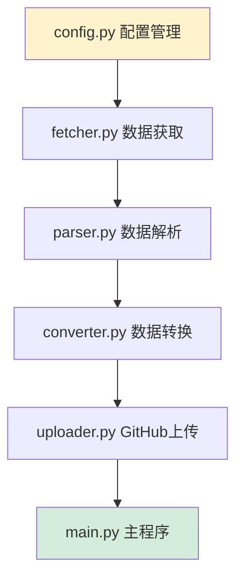

# 实施计划

本文档提供了从架构设计到完整实施的详细步骤指南。

## 📋 实施阶段概览


---

## 阶段1：环境准备

### 1.1 创建GitHub仓库

```bash
# 方式1：使用GitHub网页创建
# 1. 访问 https://github.com/new
# 2. 仓库名称：clash-cf-updater
# 3. 描述：Cloudflare优选IP自动更新系统
# 4. 选择Public或Private
# 5. 不要初始化README（我们已经有了）
# 6. 点击Create repository

# 方式2：使用GitHub CLI
gh repo create clash-cf-updater --public --description "Cloudflare优选IP自动更新系统"
```

### 1.2 初始化本地项目

```bash
# 克隆或初始化仓库
git clone https://github.com/你的用户名/clash-cf-updater.git
cd clash-cf-updater

# 或者在现有目录初始化
git init
git remote add origin https://github.com/你的用户名/clash-cf-updater.git
```

### 1.3 创建目录结构

```bash
# 创建所有必要的目录
mkdir -p .github/workflows
mkdir -p src
mkdir -p config
mkdir -p output
mkdir -p logs
mkdir -p tests

# 创建占位文件
touch logs/.gitkeep
touch output/.gitkeep
```

---

## 阶段2：配置文件创建

### 2.1 复制配置模板

根据 [`CONFIG_TEMPLATE.md`](CONFIG_TEMPLATE.md) 创建以下文件：

**优先级顺序：**

1. ✅ **必需文件（立即创建）**
   - `config/settings.yaml` - 核心配置
   - `requirements.txt` - Python依赖
   - `.gitignore` - Git忽略规则
   - `.github/workflows/update-ips.yml` - GitHub Actions配置

2. ⚠️ **重要文件（尽快创建）**
   - `LICENSE` - 开源许可证
   - `src/__init__.py` - Python包标识

3. 📝 **可选文件（后续创建）**
   - `tests/__init__.py` - 测试包标识
   - `pytest.ini` - pytest配置

### 2.2 配置文件检查清单

- [ ] `config/settings.yaml` 已创建
  - [ ] 国家列表已配置（使用中文）
  - [ ] 结果数量设置为20
  - [ ] 延迟阈值设置为200ms
  - [ ] 输出路径正确

- [ ] `requirements.txt` 已创建
  - [ ] 包含所有必需依赖
  - [ ] 版本号已指定

- [ ] `.github/workflows/update-ips.yml` 已创建
  - [ ] Cron表达式正确（每6小时）
  - [ ] Python版本设置为3.9
  - [ ] Chrome安装步骤完整

- [ ] `.gitignore` 已创建
  - [ ] 忽略日志文件
  - [ ] 忽略Python缓存
  - [ ] 忽略IDE配置

---

## 阶段3：核心模块开发

### 3.1 开发顺序



### 3.2 模块开发清单

#### 3.2.1 config.py - 配置管理模块

**功能：**
- 加载YAML配置文件
- 提供配置访问接口
- 验证配置完整性

**关键类和方法：**
```python
class Config:
    def __init__(self, config_path: str)
    def load(self) -> dict
    def get(self, key: str, default=None) -> Any
    def validate(self) -> bool
```

**测试要点：**
- [ ] 配置文件加载成功
- [ ] 配置项获取正确
- [ ] 缺失配置项返回默认值
- [ ] 无效配置抛出异常

---

#### 3.2.2 fetcher.py - 数据获取模块

**功能：**
- 初始化Selenium浏览器
- 访问目标网站
- 执行查询操作
- 提取页面内容

**关键类和方法：**
```python
class IPFetcher:
    def __init__(self, config: Config)
    def setup_driver(self) -> webdriver.Chrome
    def fetch_ips(self, country: str) -> str
    def select_country(self, country: str) -> None
    def set_result_count(self, count: int) -> None
    def click_query_button(self) -> None
    def wait_for_results(self) -> None
    def get_page_content(self) -> str
    def close(self) -> None
```

**测试要点：**
- [ ] 浏览器初始化成功
- [ ] 能够访问目标网站
- [ ] 国家选择功能正常
- [ ] 查询按钮点击成功
- [ ] 结果加载等待正确
- [ ] 页面内容提取完整
- [ ] 错误重试机制有效

**注意事项：**
- 使用无头模式（headless=True）
- 设置合理的超时时间
- 实现重试机制（最多3次）
- 正确处理元素未找到异常

---

#### 3.2.3 parser.py - 数据解析模块

**功能：**
- 解析HTML内容
- 提取节点信息
- 结构化数据

**关键类和方法：**
```python
class IPParser:
    def parse_node_list(self, html: str) -> List[dict]
    def parse_single_node(self, node_element) -> dict
    def extract_ip_port(self, text: str) -> Tuple[str, str]
    def extract_location(self, text: str) -> Tuple[str, str]
    def extract_latency(self, text: str) -> int
    def validate_ip(self, ip: str) -> bool
    def validate_port(self, port: str) -> bool
```

**数据格式：**
```python
{
    "ip": "64.110.101.90",
    "port": "55007",
    "country": "JP",
    "city": "Osaka",
    "latency": 0
}
```

**测试要点：**
- [ ] IP地址提取正确
- [ ] 端口号提取正确
- [ ] 国家代码提取正确
- [ ] 城市名称提取正确
- [ ] 延迟值提取正确
- [ ] 数据验证功能正常
- [ ] 异常数据处理正确

**正则表达式参考：**
```python
# IP:端口格式
ip_port_pattern = r'(\d{1,3}\.\d{1,3}\.\d{1,3}\.\d{1,3}):(\d+)'

# 国家|城市格式
location_pattern = r'([A-Z]{2})\s*\|\s*(.+)'

# 延迟格式
latency_pattern = r'(\d+)ms'
```

---

#### 3.2.4 converter.py - 数据转换模块

**功能：**
- 转换数据格式
- 过滤高延迟节点
- 生成输出文本

**关键类和方法：**
```python
class IPConverter:
    def convert_to_output_format(self, nodes: List[dict]) -> str
    def filter_by_latency(self, nodes: List[dict], max_latency: int) -> List[dict]
    def generate_node_name(self, country: str, city: str) -> str
    def format_single_node(self, node: dict) -> str
    def format_node_list(self, nodes: List[dict], separator: str) -> str
```

**转换规则：**
```python
# 输入
{
    "ip": "64.110.101.90",
    "port": "55007",
    "country": "JP",
    "city": "Osaka",
    "latency": 0
}

# 输出（带节点名）
"64.110.101.90:55007#JP-Osaka"

# 输出（不带节点名）
"64.110.101.90:55007"
```

**测试要点：**
- [ ] 节点名称生成正确
- [ ] 单节点格式化正确
- [ ] 多节点分隔符正确
- [ ] 延迟过滤功能正常
- [ ] 空列表处理正确

---

#### 3.2.5 uploader.py - GitHub上传模块

**功能：**
- Git操作封装
- 提交更改
- 推送到远程

**关键类和方法：**
```python
class GitHubUploader:
    def __init__(self, config: Config)
    def commit_and_push(self, file_path: str, message: str) -> bool
    def generate_commit_message(self) -> str
    def check_changes(self, file_path: str) -> bool
    def configure_git(self) -> None
```

**Git命令封装：**
```python
# 配置Git用户
git config --local user.email "github-actions[bot]@users.noreply.github.com"
git config --local user.name "github-actions[bot]"

# 添加文件
git add output/nodes.txt

# 提交
git commit -m "Update nodes - 2025-11-02 15:30:45"

# 推送
git push origin main
```

**测试要点：**
- [ ] Git配置正确
- [ ] 文件添加成功
- [ ] 提交信息格式正确
- [ ] 推送操作成功
- [ ] 无变化时跳过提交

---

#### 3.2.6 main.py - 主程序

**功能：**
- 协调各模块
- 错误处理
- 日志记录

**主流程：**
```python
def main():
    # 1. 加载配置
    # 2. 初始化日志
    # 3. 初始化各模块
    # 4. 遍历国家获取数据
    # 5. 过滤节点
    # 6. 转换格式
    # 7. 写入文件
    # 8. 提交到GitHub
    # 9. 清理资源
```

**错误处理：**
```python
try:
    # 主逻辑
except ConfigError as e:
    logger.error(f"配置错误: {e}")
except NetworkError as e:
    logger.error(f"网络错误: {e}")
except Exception as e:
    logger.critical(f"未知错误: {e}")
finally:
    # 清理资源
```

**测试要点：**
- [ ] 完整流程执行成功
- [ ] 配置加载正确
- [ ] 各模块协调正常
- [ ] 错误处理完善
- [ ] 日志输出清晰
- [ ] 资源清理彻底

---

### 3.3 开发环境设置

```bash
# 创建虚拟环境
python -m venv venv

# 激活虚拟环境
# Windows
venv\Scripts\activate
# Linux/Mac
source venv/bin/activate

# 安装依赖
pip install -r requirements.txt

# 安装开发依赖
pip install pytest pytest-cov pytest-mock black flake8
```

---

## 阶段4：测试验证

### 4.1 单元测试

```bash
# 运行所有测试
pytest tests/

# 运行特定测试
pytest tests/test_parser.py

# 生成覆盖率报告
pytest --cov=src tests/
```

### 4.2 集成测试

```bash
# 本地运行主程序
python main.py

# 检查输出文件
cat output/nodes.txt

# 验证节点格式
# 应该看到类似：64.110.101.90:55007#JP-Osaka,141.147.183.49:29876#JP-Inzai
```

### 4.3 测试清单

- [ ] 所有单元测试通过
- [ ] 代码覆盖率 > 80%
- [ ] 本地运行成功
- [ ] 输出文件格式正确
- [ ] 节点数量符合预期
- [ ] 延迟过滤生效
- [ ] 日志输出正常

---

## 阶段5：部署上线

### 5.1 提交代码到GitHub

```bash
# 添加所有文件
git add .

# 提交
git commit -m "Initial commit: Complete implementation"

# 推送到GitHub
git push -u origin main
```

### 5.2 启用GitHub Actions

1. 访问仓库的 `Actions` 标签
2. 点击 `I understand my workflows, go ahead and enable them`
3. 确认工作流已启用

### 5.3 手动触发测试

1. 进入 `Actions` 标签
2. 选择 `Update Cloudflare IPs` 工作流
3. 点击 `Run workflow` 按钮
4. 选择分支（main）
5. 点击 `Run workflow` 确认

### 5.4 验证执行结果

1. 查看工作流执行日志
2. 检查是否有错误
3. 验证 `output/nodes.txt` 文件已更新
4. 检查Git提交记录

### 5.5 部署清单

- [ ] 代码已推送到GitHub
- [ ] GitHub Actions已启用
- [ ] 手动触发测试成功
- [ ] 输出文件已生成
- [ ] Git提交记录正确
- [ ] 无错误日志

---

## 阶段6：监控维护

### 6.1 监控指标

| 指标 | 检查方式 | 正常范围 |
|------|---------|---------|
| 执行状态 | Actions页面 | 成功 ✅ |
| 节点数量 | output/nodes.txt | > 5个 |
| 执行时间 | Actions日志 | < 5分钟 |
| 文件大小 | output/nodes.txt | > 100字节 |

### 6.2 告警设置

**GitHub Actions失败通知：**
- GitHub会自动发送邮件通知
- 可在Settings > Notifications中配置

**可选：Telegram Bot通知**
```yaml
# 在workflow中添加
- name: Send Telegram notification
  if: failure()
  uses: appleboy/telegram-action@master
  with:
    to: ${{ secrets.TELEGRAM_CHAT_ID }}
    token: ${{ secrets.TELEGRAM_BOT_TOKEN }}
    message: "❌ IP更新失败！"
```

### 6.3 日常维护

**每周检查：**
- [ ] 查看Actions执行历史
- [ ] 检查节点数量变化
- [ ] 查看错误日志

**每月检查：**
- [ ] 更新Python依赖版本
- [ ] 检查网站结构是否变化
- [ ] 优化配置参数

**按需检查：**
- [ ] 网站无法访问时
- [ ] 节点数量异常时
- [ ] Actions执行失败时

---

## 阶段7：优化改进

### 7.1 性能优化

**并发获取：**
```python
from concurrent.futures import ThreadPoolExecutor

with ThreadPoolExecutor(max_workers=5) as executor:
    results = executor.map(fetch_country, countries)
```

**缓存机制：**
```python
# 实现1小时缓存
cache_file = "cache/nodes_cache.json"
if cache_valid(cache_file, max_age=3600):
    return load_cache(cache_file)
```

### 7.2 功能扩展

**支持更多输出格式：**
- Clash配置格式
- V2Ray配置格式
- Shadowsocks配置格式

**支持多数据源：**
- 添加其他优选IP网站
- 数据源聚合
- 自动切换数据源

**增强过滤功能：**
- 按国家过滤
- 按端口过滤
- 自定义正则过滤

### 7.3 文档完善

- [ ] 添加更多使用示例
- [ ] 创建故障排查指南
- [ ] 编写API文档
- [ ] 添加贡献指南

---

## 常见问题排查

### 问题1：Actions执行失败

**可能原因：**
- 网络超时
- ChromeDriver版本不匹配
- 依赖安装失败

**解决方案：**
```yaml
# 增加超时时间
timeout-minutes: 30

# 固定ChromeDriver版本
- name: Install ChromeDriver
  run: |
    wget https://chromedriver.storage.googleapis.com/114.0.5735.90/chromedriver_linux64.zip
    unzip chromedriver_linux64.zip
    sudo mv chromedriver /usr/local/bin/
```

### 问题2：节点数量为0

**可能原因：**
- 网站结构变化
- 选择的国家无节点
- 延迟过滤太严格

**解决方案：**
```python
# 添加调试日志
logger.debug(f"HTML内容: {html[:500]}")

# 放宽延迟限制
max_latency: 500

# 尝试其他国家
countries: ["日本", "美国", "香港"]
```

### 问题3：Git推送失败

**可能原因：**
- Token权限不足
- 分支保护规则
- 网络问题

**解决方案：**
```yaml
# 确保Token有写权限
permissions:
  contents: write

# 检查分支名称
git push origin main  # 不是master
```

---

## 成功标准

项目成功部署的标准：

- ✅ 所有配置文件已创建
- ✅ 所有模块代码已实现
- ✅ 单元测试覆盖率 > 80%
- ✅ 本地测试运行成功
- ✅ GitHub Actions自动运行
- ✅ 输出文件格式正确
- ✅ 节点数量 > 5个
- ✅ 定时任务正常执行
- ✅ 文档完整清晰

---

## 时间估算

| 阶段 | 预计时间 | 说明 |
|------|---------|------|
| 环境准备 | 0.5小时 | 创建仓库、目录结构 |
| 配置文件 | 0.5小时 | 复制模板、修改配置 |
| 核心模块 | 3-4小时 | 编写所有模块代码 |
| 测试验证 | 1-2小时 | 单元测试、集成测试 |
| 部署上线 | 0.5小时 | 推送代码、启用Actions |
| 监控调试 | 0.5小时 | 验证运行、修复问题 |
| **总计** | **6-8小时** | 完整实施周期 |

---

## 下一步行动

完成架构设计后，请按以下顺序执行：

1. ✅ **审查架构设计文档**
   - 阅读 [`ARCHITECTURE.md`](ARCHITECTURE.md)
   - 确认设计方案符合需求

2. 🔄 **切换到Code模式**
   - 使用 `switch_mode` 工具
   - 开始实施开发

3. 📝 **按阶段实施**
   - 严格按照本文档的阶段顺序
   - 每完成一个阶段进行验证

4. ✅ **测试和部署**
   - 完成开发后进行全面测试
   - 部署到GitHub Actions

5. 📊 **监控和优化**
   - 持续监控运行状态
   - 根据实际情况优化配置

---

**祝实施顺利！** 🚀