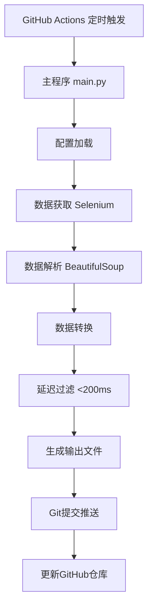

# Clash 优选IP自动更新系统

[](https://github.com/features/actions)
[](https://zeabur.com)
[](https://www.python.org/)
[](LICENSE)

自动从多个数据源获取优选Cloudflare节点IP，转换格式后自动更新到GitHub仓库，供订阅项目使用。

## 🚀 部署方式

### 方式1: Zeabur部署 (推荐) ⭐

**优势**:
- ✅ 内置定时任务,无需GitHub Actions
- ✅ 提供Web界面和API接口
- ✅ 支持手动触发和状态查看
- ✅ 24/7运行,更稳定可靠

**快速开始**:
- 📖 [5分钟快速部署](ZEABUR_QUICKSTART.md)
- 📚 [完整部署文档](ZEABUR_DEPLOYMENT.md)

### 方式2: GitHub Actions部署

**优势**:
- ✅ 完全免费(公开仓库)
- ✅ 无需服务器
- ✅ 配置简单

**快速开始**: 见下方[GitHub Actions配置](#github-actions配置)

---

## ✨ 特性

- 🤖 **全自动运行** - 支持GitHub Actions和Zeabur两种部署方式
- 🌍 **多国家支持** - 可配置多个国家/地区的节点
- ⚡ **智能过滤** - 自动过滤高延迟节点（默认<200ms）
- 📝 **灵活格式** - 支持多种输出格式
- 🔄 **定时更新** - 可自定义更新频率（默认每6小时）
- 📊 **详细日志** - 完整的执行日志和错误追踪
- 🎯 **CF-RAY检测** - 自动识别Cloudflare节点真实数据中心位置

### 🎯 Cloudflare节点真实位置检测

- 通过CF-RAY响应头获取Cloudflare节点真实数据中心位置
- 支持100+个全球数据中心的机场代码映射
- 自动识别并检测Cloudflare IP
- 检测失败时自动回退到CF-Anycast标记
- 批量并发检测，性能优化

详细说明请参考：[CF_RAY_DETECTION.md](CF_RAY_DETECTION.md)

## 📋 目录

- [快速开始](#快速开始)
- [配置说明](#配置说明)
- [输出格式](#输出格式)
- [使用方法](#使用方法)
- [架构设计](#架构设计)
- [常见问题](#常见问题)
- [贡献指南](#贡献指南)
- [许可证](#许可证)

## 🚀 快速开始

### 1. Fork本仓库

点击右上角的 `Fork` 按钮，将仓库复制到你的账号下。

### 2. 启用GitHub Actions

1. 进入你Fork的仓库
2. 点击 `Actions` 标签
3. 点击 `I understand my workflows, go ahead and enable them`

### 3. 配置参数（可选）

编辑 [`config/settings.yaml`](config/settings.yaml) 文件，根据需要修改配置：

```yaml
source:
  countries:
    - "日本"
    - "美国"
    - "香港"
    - "新加坡"
  result_count: 20

filter:
  max_latency: 200
```

### 4. 手动触发测试

1. 进入 `Actions` 标签
2. 选择 `Update Cloudflare IPs` 工作流
3. 点击 `Run workflow` 按钮
4. 等待执行完成，查看 `output/nodes.txt` 文件

### 5. 使用输出文件

获取节点列表的URL：
```
https://raw.githubusercontent.com/你的用户名/clash-cf-updater/main/output/nodes.txt
```

## 🔧 GitHub Actions配置

### 设置GitHub Secrets

本项目需要配置GitHub Secrets来安全地存储敏感信息。

#### 1. 创建Personal Access Token

1. 访问 [GitHub Settings > Developer settings > Personal access tokens > Tokens (classic)](https://github.com/settings/tokens)
2. 点击 **Generate new token (classic)**
3. 设置Token名称，例如：`clash-cf-updater-token`
4. 勾选以下权限：
   - ✅ `repo` (完整的仓库访问权限)
5. 点击 **Generate token**
6. **重要**：立即复制生成的token（格式：`ghp_xxxxxxxxxxxx`），离开页面后将无法再次查看

#### 2. 配置Repository Secrets

在你的GitHub仓库中设置Secrets：

1. 进入仓库的 **Settings** > **Secrets and variables** > **Actions**
2. 点击 **New repository secret**
3. 添加以下secrets：

| Secret名称 | 说明 | 示例值 |
|-----------|------|--------|
| `GH_TOKEN` | GitHub Personal Access Token | `ghp_xxxxxxxxxxxx` |
| `TARGET_REPO` | 目标仓库（用于上传IP文件） | `EseeEhin/cf-ip` |

**配置截图示例：**

```
Name: GH_TOKEN
Secret: ghp_xxxxxxxxxxxx (你的token)

Name: TARGET_REPO
Secret: EseeEhin/cf-ip (或你的目标仓库)
```

### 工作流说明

本项目包含两个GitHub Actions工作流：

#### 1. 自动更新工作流 (update-ips.yml)

**触发条件：**
- ⏰ **定时触发**：每天北京时间 8:00, 14:00, 20:00 自动执行
- 🖱️ **手动触发**：在Actions页面手动运行
- 📤 **Push触发**：推送到main分支时运行

**执行步骤：**
1. 检出代码
2. 设置Python 3.12环境
3. 安装项目依赖
4. 运行IP获取和上传脚本
5. 上传执行日志（保留7天）

#### 2. 手动更新工作流 (manual-update.yml)

**特点：**
- 🎛️ **参数化运行**：可自定义国家列表、IP数量等参数
- 🔍 **调试友好**：同时上传日志和输出文件
- ⚡ **灵活控制**：支持强制更新选项

**使用方法：**
1. 进入仓库的 **Actions** 标签
2. 选择 **Manual Update IPs** 工作流
3. 点击 **Run workflow**
4. 填写参数（可选）：
   - **Countries**: 国家代码，逗号分隔（如：`JP,US,SG`）
   - **Limit**: 每个国家的IP数量（默认：100）
   - **Force update**: 是否强制更新
5. 点击 **Run workflow** 开始执行

### 修改更新频率

编辑 [`.github/workflows/update-ips.yml`](.github/workflows/update-ips.yml) 文件中的cron表达式：

```yaml
on:
  schedule:
    # UTC时间，需要转换为北京时间（UTC+8）
    - cron: '0 0,6,12 * * *'  # 北京时间 8:00, 14:00, 20:00
```

**常用时间配置：**

| Cron表达式 | 北京时间 | 说明 |
|-----------|---------|------|
| `0 0,6,12 * * *` | 8:00, 14:00, 20:00 | 每天3次（推荐） |
| `0 0,8,16 * * *` | 8:00, 16:00, 0:00 | 每天3次 |
| `0 */6 * * *` | 每6小时 | 8:00, 14:00, 20:00, 2:00 |
| `0 0,12 * * *` | 8:00, 20:00 | 每天2次 |
| `0 0 * * *` | 8:00 | 每天1次 |

**注意**：GitHub Actions使用UTC时间，北京时间需要减去8小时。

### 查看执行日志

1. 进入仓库的 **Actions** 标签
2. 选择要查看的工作流运行记录
3. 点击进入查看详细日志
4. 可以下载日志文件（Artifacts）进行离线分析

### 常见问题排查

#### Actions执行失败

**检查清单：**
- ✅ 确认已正确配置 `GH_TOKEN` 和 `TARGET_REPO` Secrets
- ✅ 确认Token具有足够的权限（repo权限）
- ✅ 确认目标仓库存在且可访问
- ✅ 查看详细日志定位具体错误

#### Token权限不足

**错误信息：** `403 Forbidden` 或 `Resource not accessible by integration`

**解决方法：**
1. 重新生成Token，确保勾选 `repo` 权限
2. 更新仓库中的 `GH_TOKEN` Secret

#### 工作流未自动运行

**可能原因：**
- Fork的仓库默认禁用Actions，需要手动启用
- Cron触发可能有几分钟延迟
- 仓库长期无活动可能暂停定时任务

**解决方法：**
1. 进入 **Actions** 标签，启用工作流
2. 手动触发一次测试
3. 保持仓库活跃（定期有commit）

### 使用限制

GitHub Actions免费额度：
- **公开仓库**：无限制
- **私有仓库**：每月2000分钟（免费账户）

本项目单次运行约需要2-5分钟，每天运行3次，月消耗约180-450分钟。

## ⚙️ 配置说明

### CF-RAY检测配置

在`.env`文件中配置CF-RAY检测参数：

```env
# 是否启用CF-RAY检测（默认：true）
CF_RAY_DETECTION_ENABLED=true

# CF-RAY检测超时时间，单位：秒（默认：5）
CF_RAY_TIMEOUT=5

# CF-RAY检测最大并发数（默认：10）
CF_RAY_MAX_WORKERS=10
```

**配置说明：**

- `CF_RAY_DETECTION_ENABLED`：是否启用CF-RAY检测功能
  - `true`：启用，获取Cloudflare节点真实位置
  - `false`：禁用，所有Cloudflare IP显示为`CF-Anycast`

- `CF_RAY_TIMEOUT`：单个IP的检测超时时间（秒）
  - 网络良好：3-5秒
  - 网络较差：8-10秒

- `CF_RAY_MAX_WORKERS`：并发检测的最大线程数
  - 少量IP（<50）：5-10
  - 大量IP（>100）：15-20

详细配置说明请参考：[CF_RAY_DETECTION.md](CF_RAY_DETECTION.md#配置说明)

### 数据源配置

```yaml
source:
  url: "https://cfip.wxgqlfx.fun/"
  countries:              # 要获取的国家列表
    - "日本"
    - "美国"
    - "香港"
    - "新加坡"
  result_count: 20        # 每个国家获取的节点数量
  timeout: 30             # 请求超时时间（秒）
```

### 过滤配置

```yaml
filter:
  max_latency: 200        # 最大延迟（毫秒），超过此值的节点将被过滤
  min_nodes: 5            # 最少节点数，低于此值会记录警告
```

### 输出配置

```yaml
output:
  file_path: "output/nodes.txt"
  format: "ip_port_name"  # 输出格式：ip_port_name 或 ip_port
  separator: ","          # 节点分隔符
```

### GitHub Actions配置

```yaml
github:
  branch: "main"
  commit_message_template: "Update nodes - {timestamp}"
```

### 更新频率配置

编辑 [`.github/workflows/update-ips.yml`](.github/workflows/update-ips.yml)：

```yaml
on:
  schedule:
    - cron: '0 */6 * * *'  # 每6小时执行一次
```

**常用Cron表达式：**
- `0 * * * *` - 每小时
- `0 */6 * * *` - 每6小时（推荐）
- `0 */12 * * *` - 每12小时
- `0 0 * * *` - 每天0点

## 📤 输出格式

### 格式1：带节点名称（默认）

```
64.110.101.90:55007#JP-Osaka,141.147.183.49:29876#JP-Inzai,138.2.59.96:10129#JP-Tokyo
```

**格式说明：**
- `IP:端口#节点名称`
- 节点名称格式：`国家代码-城市名`
- 多个节点用逗号分隔

### 格式2：仅IP和端口

```
64.110.101.90:55007,141.147.183.49:29876,138.2.59.96:10129
```

**切换方式：**

修改 `config/settings.yaml`：
```yaml
output:
  format: "ip_port"  # 改为 ip_port
```

### CF-RAY检测输出对比

#### 启用CF-RAY检测后

```
104.16.132.229:443#A-JP-Tokyo        # Cloudflare东京节点
172.64.229.95:443#B-HK-Hong Kong     # Cloudflare香港节点
104.18.35.42:2053#C-US-Los Angeles   # Cloudflare洛杉矶节点
```

显示Cloudflare节点的真实数据中心位置。

#### 未启用或检测失败时

```
104.16.132.229:443#A-CF-Anycast      # 回退到Anycast标记
172.64.229.95:443#B-CF-Anycast
104.18.35.42:2053#C-CF-Anycast
```

所有Cloudflare IP都显示为`CF-Anycast`。

**注意**：检测失败时会自动回退到`CF-Anycast`标记，不影响程序正常运行。

## 📖 使用方法

### 方式1：直接使用原始链接

```
https://raw.githubusercontent.com/你的用户名/clash-cf-updater/main/output/nodes.txt
```

### 方式2：使用CDN加速（推荐）

```
https://cdn.jsdelivr.net/gh/你的用户名/clash-cf-updater@main/output/nodes.txt
```

### 方式3：在Clash配置中使用

```yaml
proxies:
  - name: "CF-优选节点"
    type: vmess
    server: 从nodes.txt获取
    port: 从nodes.txt获取
    # ... 其他配置
```

### 方式4：订阅转换

将节点列表URL提交到订阅转换服务，生成Clash/V2Ray等配置。

## 🏗️ 架构设计

详细的架构设计文档请查看：[ARCHITECTURE.md](ARCHITECTURE.md)

### 系统架构图



### 项目结构

```
clash-cf-updater/
├── .github/workflows/      # GitHub Actions配置
├── src/                    # 源代码
│   ├── fetcher.py         # 数据获取模块
│   ├── parser.py          # 数据解析模块
│   ├── converter.py       # 数据转换模块
│   └── config.py          # 配置管理模块
├── config/                 # 配置文件
│   └── settings.yaml
├── output/                 # 输出文件
│   └── nodes.txt
├── tests/                  # 测试文件
├── main.py                 # 主程序入口
├── requirements.txt        # Python依赖
├── ARCHITECTURE.md         # 架构设计文档
└── README.md              # 项目说明（本文件）
```

## 🔧 本地开发

### 环境要求

- Python 3.9+
- Chrome/Chromium浏览器
- ChromeDriver

### 安装依赖

```bash
pip install -r requirements.txt
```

### 运行程序

```bash
python main.py
```

### 运行测试

```bash
pytest tests/
```

## ❓ 常见问题

### Q1: GitHub Actions执行失败怎么办？

**A:** 查看Actions日志，常见原因：
- 网络超时：增加重试次数
- 依赖安装失败：检查requirements.txt
- ChromeDriver版本不匹配：更新工作流配置

### Q2: 获取的节点数量为0？

**A:** 可能原因：
- 目标网站结构变化：需要更新解析逻辑
- 选择的国家没有可用节点：尝试其他国家
- 延迟过滤太严格：调整max_latency参数

### Q3: 如何添加更多国家？

**A:** 编辑 `config/settings.yaml`：
```yaml
source:
  countries:
    - "日本"
    - "美国"
    - "香港"
    - "新加坡"
    - "德国"      # 新增
    - "英国"      # 新增
```

### Q4: 如何修改更新频率？

**A:** 编辑 `.github/workflows/update-ips.yml`，修改cron表达式：
```yaml
schedule:
  - cron: '0 */3 * * *'  # 改为每3小时
```

### Q5: 输出文件可以自定义路径吗？

**A:** 可以，编辑 `config/settings.yaml`：
```yaml
output:
  file_path: "data/my-nodes.txt"  # 自定义路径
```

### Q6: 如何查看执行日志？

**A:** 
1. 进入GitHub仓库的 `Actions` 标签
2. 点击最近的工作流运行
3. 查看详细日志输出

### Q7: 可以手动触发更新吗？

**A:** 可以，在Actions页面点击 `Run workflow` 按钮手动触发。

## 🤝 贡献指南

欢迎贡献代码、报告问题或提出建议！

### 贡献流程

1. Fork本仓库
2. 创建特性分支 (`git checkout -b feature/AmazingFeature`)
3. 提交更改 (`git commit -m 'Add some AmazingFeature'`)
4. 推送到分支 (`git push origin feature/AmazingFeature`)
5. 开启Pull Request

### 代码规范

- 遵循PEP 8编码规范
- 添加必要的注释和文档
- 编写单元测试
- 更新相关文档

## 📝 更新日志

### v1.0.0 (2025-11-02)

- ✨ 初始版本发布
- 🤖 支持GitHub Actions自动运行
- 🌍 支持多国家节点获取
- ⚡ 智能延迟过滤
- 📝 灵活的输出格式

## 📄 许可证

本项目采用 MIT 许可证 - 查看 [LICENSE](LICENSE) 文件了解详情。

## 🙏 致谢

- 数据源：[cfip.wxgqlfx.fun](https://cfip.wxgqlfx.fun/)
- 技术支持：[@wxgqlfx](https://t.me/wxgqlfx)

## 📮 联系方式

如有问题或建议，请：
- 提交 [Issue](https://github.com/你的用户名/clash-cf-updater/issues)
- 发起 [Discussion](https://github.com/你的用户名/clash-cf-updater/discussions)

---

⭐ 如果这个项目对你有帮助，请给个Star支持一下！